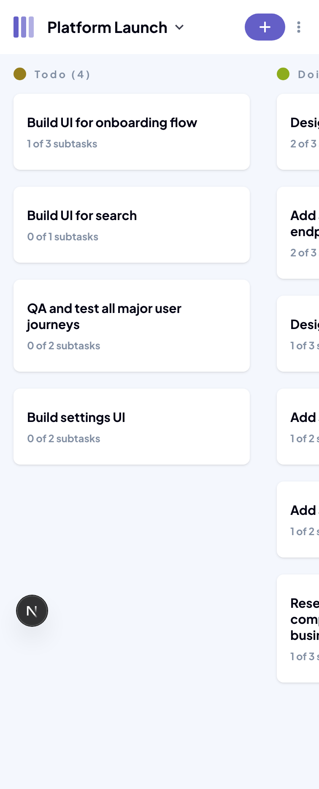
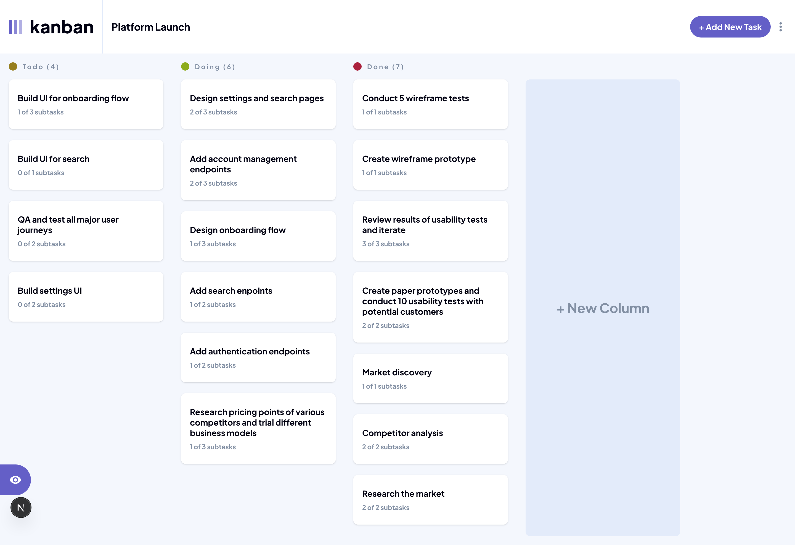

# Frontend Mentor - Kanban task management web app solution

This is a solution to the [Kanban task management web app challenge on Frontend Mentor](https://www.frontendmentor.io/challenges/kanban-task-management-web-app-wgQLt-HlbB). Frontend Mentor challenges help you improve your coding skills by building realistic projects.

## Table of contents

- [Overview](#overview)
  - [The challenge](#the-challenge)
  - [Screenshot](#screenshot)
  - [Links](#links)
- [My process](#my-process)
  - [Built with](#built-with)
- [Author](#author)

## Overview

This Kanban Task Management web app is designed to help users organize projects and tasks efficiently. It allows creating multiple boards, each containing columns and tasks that can be updated, tracked, and managed in a visually intuitive way. The app is fully responsive, with layouts optimized for both desktop and mobile devices.

### The challenge

Users should be able to:

- View the optimal layout for the app depending on their device's screen size
- See hover states for all interactive elements on the page
- Create, read, update, and delete boards and tasks
- Receive form validations when trying to create/edit boards and tasks
- Mark subtasks as complete and move tasks between columns
- Hide/show the board sidebar
- Toggle the theme between light/dark modes
- **Bonus**: Allow users to drag and drop tasks to change their status and re-order them in a column
- **Bonus**: Keep track of any changes, even after refreshing the browser (`localStorage` could be used for this if you're not building out a full-stack app)
- **Bonus**: Build this project as a full-stack application

### Screenshot

### Links

- Solution URL: [Add solution URL here](https://your-solution-url.com)
- Live Site URL: [Add live site URL here](https://your-live-site-url.com)

## My process

I began the project by planning the backend architecture. To ensure persistence and scalability, I chose Next.js with MongoDB as the foundation. The initial JSON data was normalized and split into structured collections for boards, columns, tasks, and subtasks, each with unique IDs to enable seamless interaction between entities.

Since the challenge did not include user authentication, I implemented a lightweight solution by storing a userId in cookies, allowing users to save their data changes while still starting from the same initial dataset.

With the data layer in place, I turned to the interface. I carefully reviewed the Figma design file and followed a mobile-first workflow to ensure responsiveness from the ground up. Using Tailwind CSS, I developed a clean and adaptable layout that works consistently across mobile, tablet, and desktop breakpoints.

Finally, I integrated the backend with the frontend, implementing full CRUD functionality for boards and tasks. This ensured that the app not only aligned with the design specifications but also provided a reliable and intuitive user experience.

### Built with

- [Next.js](https://nextjs.org/) – React framework for building the frontend and backend
- [TypeScript](https://www.typescriptlang.org/) – For type safety and maintainability
- [MongoDB](https://www.mongodb.com/) – Database for persistence
- [Mongoose](https://mongoosejs.com/) – ODM for MongoDB
- [Tailwind CSS](https://tailwindcss.com/) – Utility-first CSS framework for styling
- [React](https://reactjs.org/) – Core library for building UI components
- Mobile-first responsive design approach

## Author

- Frontend Mentor - [@maziarja](https://www.frontendmentor.io/profile/maziarja)
- Twitter - [@maz_alem](https://x.com/maz_alem)
- LinkedIn - [@maziar-jamalialem](https://www.linkedin.com/in/maziar-jamalialem-677030345/)
